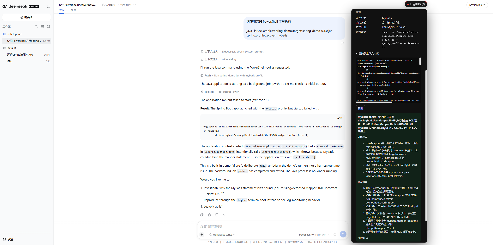

<h1 align="center">dsh-loghud</h1>

<p align="center">
  <a href="./README.md">简体中文</a> | <a href="./README_EN.md">English</a>
</p>

<p align="center">
  <a href="https://dsh.market/"></a>
</p>

`dsh-loghud` is an extensible local development error-monitoring Web plugin for DeepSeek Harness `0.1.1-rc.2`. v0.3.0 supports Python, Node.js, TypeScript, Java, and Spring, turning runtime, compile, module-resolution, build, test, and startup failures into bounded, deduplicated error cards.

AI explanations are strictly opt-in. Detecting an error never calls a model automatically.

v0.3.0 supports Python, Node.js/TypeScript, and Java/Spring. Go and other ecosystems remain planned for later releases. Production monitoring, native crashes, and arbitrary text-log monitoring remain out of scope.

## Preview



> DeepSeek Harness is still a developer preview. This plugin pins every `@deepseek-ai/*` dependency to the same RC version and only uses public Cordis services, Tool events, Terminal, LLM Streaming, Web routes, and Client Slots.

## Compatibility

| dsh-loghud | DeepSeek Harness | Status |
| --- | --- | --- |
| v0.3.0 | 0.1.1-rc.2 | Tested |

## Features

- Detects Node.js runtime errors, TypeScript `TSxxxx` diagnostics, missing modules, network failures, package-manager lifecycle failures, and Vite/Rollup/Webpack/Next.js build errors.
- Detects Python 3.10–3.14 tracebacks, chained exceptions, import failures, syntax errors, unhandled asyncio task failures, and pytest failures.
- Preserves Spring IOC, MyBatis, MySQL/database, Redis, Spring MVC, Java runtime, and startup detection.
- Extracts language, toolchain, error code, root cause, business frame, file, line, column, target, and port.
- Merges repeated errors using stable fingerprints and tracks occurrence count and last-seen time.
- Isolates active, resolved, and ignored errors by Session; ignored errors do not make health `BROKEN`.
- Supports manual resolution, clearing resolved history, and clearing the current Session.
- Pushes revisioned snapshots through SSE and exposes connection/reconnection state.
- Adds search, language/category filters, JSON/Markdown export, and a draggable/resizable persisted layout.
- Supports Chinese and English UI, Harness light/dark theme variables, and keyboard operation.
- Adds a dedicated LogHUD page to the native Harness Settings menu with live, durable, resettable preferences.
- Runs AI diagnosis only on request and redacts common secrets before sending context.

## Capture modes

- **Ordinary Harness shell tools (`tool-result`)**: `tools/result` is read-only and final, so the HUD updates after the command completes.
- **Harness background jobs**: `pwsh` or shell job handles are correlated with their final `job_output`; partial polls and unrelated PowerShell commands do not change project health.
- **Incremental mode (`streaming-tool`)**: ask the Agent to use `loghud_run`, or call it directly. The command runs through the official Terminal service and output deltas are continuously sent to the collector.

The plugin never replaces or monkey-patches the native Harness shell. The UI clearly identifies the current capture mode.

## Installation

Install the current stable release directly:

```sh
dsh plugin --profile web add https://github.com/XuXcode/dsh-loghud/releases/download/v0.3.0/dsh-loghud-0.3.0.tgz
```

Run `dsh --profile web --dump-config` after installation. The dumped Web profile should contain the enabled `dsh-loghud` patch. Then start Harness normally and open a Coding Session.

## Build from source

Node.js 22.19 or later and pnpm are required.

```sh
pnpm install
pnpm check
pnpm pack
dsh plugin --profile web add ./dsh-loghud-0.3.0.tgz
dsh --profile web --dump-config
```

Drag the `LogHUD` badge or panel header and resize the panel from its bottom-right corner. The browser remembers both position and size. `Alt` plus arrow keys also moves the panel, and the HUD can restore its default layout. Monitoring preferences live on the dedicated `LogHUD` page in Harness Settings and follow the active Harness locale.

## Support matrix

| Ecosystem | v0.3.0 | Typical errors |
| --- | --- | --- |
| Node.js / JavaScript | Supported | TypeError, missing modules, EADDRINUSE, ECONNREFUSED |
| TypeScript | Supported | TSxxxx and Vite/Rollup/Webpack/Next.js build failures |
| Java / Spring | Supported | IOC, MyBatis, database, Redis, MVC, runtime, startup |
| Python 3.10–3.14 | Supported | Traceback, imports, SyntaxError, asyncio, pytest |
| Go | Later release | Not implemented |

The dependency-free demos are in [`examples/node-demo`](examples/node-demo/README.md) and [`examples/python-demo`](examples/python-demo/README.md).

## Configuration

```yaml
enabled: true
enableAiAnalysis: true       # manual only; never automatic
maxErrorContextLines: 120
maxActiveErrors: 100
maxResolvedHistory: 50
maxIgnoredHistory: 50
secretRedaction: true
beginnerFriendly: true
```

Prefer editing these values on the native `LogHUD` page in Harness Settings. Cordis patch values form the composition base and durable Harness user settings override them. Lowering an active, resolved, or ignored limit prunes old cards immediately. Turning `enabled` off hides the HUD and stops new capture and AI requests without deleting existing errors.

Missing Terminal support disables only `loghud_run`; final tool-result detection continues. Missing LLM routing disables only diagnosis and leaves every local error card intact. Without a compatible `storageDomain`, state remains bounded and process-local.

## Detection and health state

The parser chain runs TypeScript, Node.js, Python, Spring, Java, and Generic parsers in a fixed priority order. It selects the first non-dependency, non-runtime-internal business frame and normalizes paths, Python environments, build hashes, PIDs, ports, and temporary directories before creating a stable SHA-256 fingerprint.

Health states are defined as follows:

- `UNKNOWN`: no supported command has been observed.
- `HEALTHY`: a command has been observed successfully and there are no active errors.
- `BROKEN`: at least one active error card exists.

Automatic recovery is deliberately narrow. A successful Spring startup marker with no error exit resolves related startup errors only within the same command family. The plugin does not guess causality for other errors.

## AI diagnosis and privacy

No model is called before the AI diagnosis button is clicked. A single user action creates at most one diagnosis request, and concurrent requests for the same error version are coalesced.

The model receives only a structured error summary, exception chain, bounded context, and command type. With secret redaction enabled, Bearer tokens, JWTs, passwords, API keys, URL credentials, private keys, and common secret environment variables are replaced before transmission. AI timeout, cancellation, or response errors never remove the locally detected error.

## HTTP and SSE API

All Session IDs and error fingerprints are validated at the route boundary.

- `GET /api/loghud/:sessionId/snapshot`
- `GET /api/loghud/:sessionId/events`
- `POST /api/loghud/:sessionId/diagnose`
- `POST /api/loghud/:sessionId/resolve`
- `POST /api/loghud/:sessionId/ignore`
- `POST /api/loghud/:sessionId/unignore`
- `POST /api/loghud/:sessionId/clear-resolved`
- `POST /api/loghud/:sessionId/clear`

See [architecture](docs/architecture.md), [technical feasibility](docs/technical-feasibility.md), [limitations](docs/limitations.md), [verification record](docs/verification.md), and the [demo project](examples/spring-demo/README.md).

## Development and verification

```sh
pnpm typecheck
pnpm test
pnpm build
pnpm pack:check
```

## License

This project is licensed under the [MIT License](./LICENSE).
