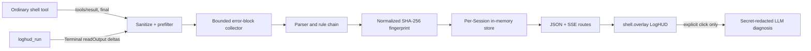

# Architecture

## Host

`LogHudRuntime` requires the public `tools` and `webServer` services. It observes the frozen `tools/result` outcome without changing it, and registers `loghud_run` with `defineTool`. Terminal and LLM are read through `ctx.get()` at use time so their absence is a feature-level degradation, not a boot failure.

The streaming tool creates an owner-scoped official terminal using the active Agent, submits one command, drains `readOutput()` deltas, cooperates with caller cancellation and timeout, then kills its terminal in `finally`.

## Collector and store

Input normalization removes ANSI/control bytes and joins CRLF and arbitrary chunks. The collector keeps one bounded candidate block and flushes on a distinct top-level error, normal boundaries, command completion, or the line cap. The parser chooses a specialized rule, extracts chain/location/target fields, and fingerprints normalized root facts.

Each Session owns an independent map keyed by fingerprint. Snapshots contain only bounded error context, never a general log archive. Mutations increment a revision; SSE subscribers receive snapshot-level coalesced updates rather than React rendering every terminal line.

## Client

Harness `details` is a single slot already owned by the standard conversation UI. Replacing it would remove native tool details. The plugin therefore registers additively in the official `shell.overlay` list slot and renders a keyboard-accessible right-side drawer. It consumes current Session state through the runtime-provided `useSessions` selector and follows Harness theme variables with safe fallbacks.

## AI boundary

Diagnosis requests are keyed by `fingerprint:version`; concurrent requests share a promise. The prompt contains only structured fields and at most 80 recent context lines after Bearer/JWT/password/API-key/URL-credential/PEM redaction. Model text is parsed to a fixed JSON shape and rendered as React text, never arbitrary HTML.
