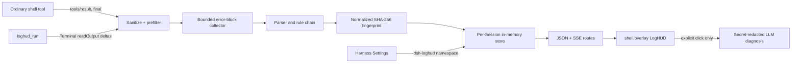

# Architecture

## v0.3 parser and state model

`LogProcessor` feeds bounded blocks into registered `LogErrorParser` implementations. Built-in priority is TypeScript, Node.js, Python, Spring, Java, then Generic. Parsers publish JSON-safe language, runtime, toolchain, parser ID, error code, file, line, and column metadata. Python parsing understands standard and chained tracebacks, syntax locations, asyncio task failures, and pytest output. Fingerprints include the first business frame and command family after dependency paths, Python environments, build hashes, PIDs, ports, and runtime-internal frames are normalized.

Snapshot schema version 3 contains bounded active, resolved, and ignored lists plus the number of active cards dropped by the configured bound. Legacy v0.1/v0.2 records receive defaults during validation. SSE snapshots carry the Store revision as the event ID, and every connection or reconnection receives a complete current snapshot. JSON and Markdown exports are generated in the browser.

## Host

`LogHudRuntime` requires the public `tools` and `webServer` services. It observes the frozen `tools/result` outcome without changing it, and registers `loghud_run` with `defineTool`. Terminal and LLM are read through `ctx.get()` at use time so their absence is a feature-level degradation, not a boot failure.

The streaming tool creates an owner-scoped official terminal using the active Agent, submits one command, drains `readOutput()` deltas, cooperates with caller cancellation and timeout, then kills its terminal in `finally`.

## Native settings

The Host registers the `dsh-loghud` namespace through the public Settings service. Schemastery defaults are layered below Cordis entry configuration and the durable user section. Changes are applied live to `ErrorStore`; lowering bounds prunes immediately. Without a mounted Settings provider, `installSettingsSection` keeps the Cordis entry authoritative and the plugin continues normally.

The browser binds the same namespace through `ctx.settingsScope` and contributes a root-scoped `settings.section` page. Writes are one validated field at a time and `unset` restores inheritance. Remote or read-only browsers render an inert explanation instead of calling private APIs. Session snapshots remain in `storageDomain`; settings are not duplicated there.

## Collector and store

Input normalization removes ANSI/control bytes and joins CRLF and arbitrary chunks. The collector keeps one bounded candidate block and flushes on a distinct top-level error, normal boundaries, command completion, or the line cap. The parser chooses a specialized rule, extracts chain/location/target fields, and fingerprints normalized root facts.

Each Session owns an independent map keyed by fingerprint. Snapshots contain only bounded error context, never a general log archive. Mutations increment a revision; SSE subscribers receive snapshot-level coalesced updates rather than React rendering every terminal line.

## Client

Harness `details` is a single slot already owned by the standard conversation UI. Replacing it would remove native tool details. The plugin therefore registers additively in the official `shell.overlay` list slot and renders a keyboard-accessible right-side drawer. It consumes current Session state through the runtime-provided `useSessions` selector and follows Harness theme variables with safe fallbacks.

## AI boundary

Diagnosis requests are keyed by `fingerprint:version`; concurrent requests share a promise. The prompt contains only structured fields and at most 80 recent context lines after Bearer/JWT/password/API-key/URL-credential/PEM redaction. Model text is parsed to a fixed JSON shape and rendered as React text, never arbitrary HTML.
